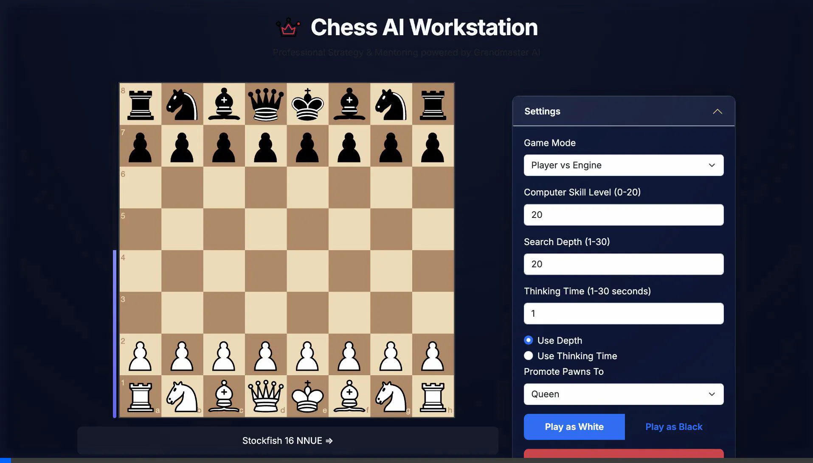
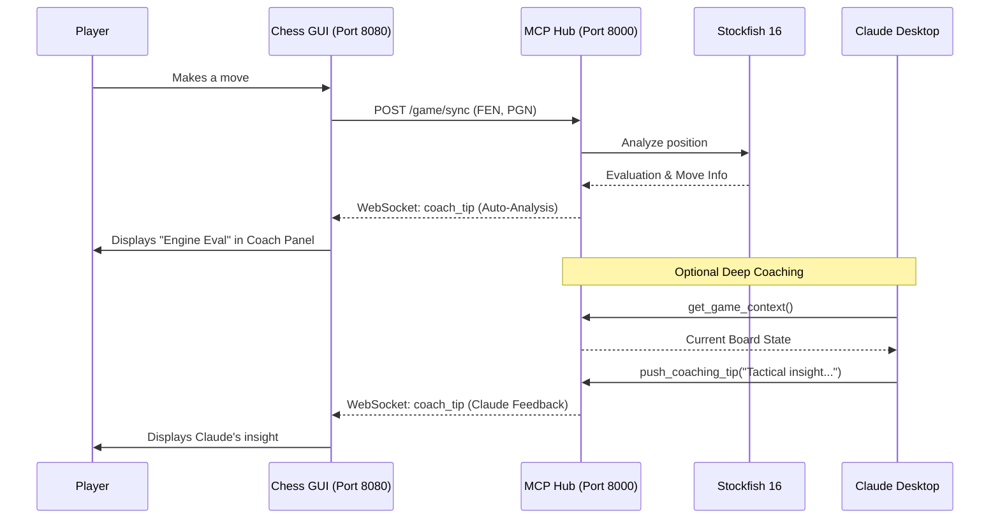

# Grandmaster-MCP: Chess Intelligence & AI Coach

Grandmaster-MCP is an advanced chess intelligence system that bridges the gap between a local Stockfish 16 engine and Large Language Models (like Claude). It combines a high-performance chess GUI with a real-time coaching layer.

## 📺 Demonstration



## 🏗 Architecture



## 🌟 Key Features

- **Integrated Chess AI Coach GUI**: A real-time chess web interface powered by Stockfish 16.
- **Live Auto-Analysis**: Automatically pushes engine evaluations to the GUI after every move.
- **MCP Tool Integration**:
  - `analyze_pgn`: Full move-by-move analysis.
  - `get_hint` & `get_best_move`: Context-aware tactical suggestions.
  - `push_coaching_tip`: Allows Claude to broadcast custom coaching messages to the GUI.
- **WebSocket Hub**: Ensures instant, bi-directional communication between the game and the AI.

## 🛠 Setup Instructions

### 1. Prerequisites
- **Python 3.10+**
- **[uv](https://github.com/astral-sh/uv)** (Python package manager)
- **Stockfish 16**: `brew install stockfish` (on macOS) or ensures it's in your PATH.

### 2. Backend Initialization
```bash
# Install dependencies
uv sync

# Start the MCP Hub & WebSocket Server
uv run python mcp_server.py
```
The server will start on `http://localhost:8000`.

### 3. Frontend Initialization
```bash
# Navigate to GUI folder
cd stockfish-chess-web-gui

# Start a local web server
python3 -m http.server 8080
```
Then open **[http://localhost:8080](http://localhost:8080)** in your browser.

### 4. Claude Desktop Integration
Add the following to your `claude_desktop_config.json`:
```json
"Grandmaster-Coach": {
  "command": "uv",
  "args": [
    "--directory",
    "/Users/riteshsingh/Desktop/Files/VSCode/chess_analyzer",
    "run",
    "mcp_server.py"
  ]
}
```

## 🚀 How to Use

1. **Play a Move**: Make a move in the browser.
2. **Watch the Coach**: The "AI Coach" panel will instantly show an engine evaluation (e.g., `+0.50`).
3. **Ask Claude**: In Claude Desktop, ask: *"How is my position looking?"* or *"Give me a coaching tip."* Claude will analyze the live game state and push a message directly to your browser panel.

## 🔍 Troubleshooting
-**Stop all the running server**:lsof -ti :8080,8000 | xargs kill -9
- **Panel shows "OFFLINE"**: Ensure the `mcp_server.py` is running and no other process is using port 8000.
- **No tips appearing**: Ensure you only have **one** instance of the server running (either in a terminal or launched by Claude Desktop, not both).
- **Stockfish not found**: Run `brew install stockfish` or update `STOCKFISH_PATH` in `mcp_server.py`.

---
*Created by Antigravity AI Coach Integration*
